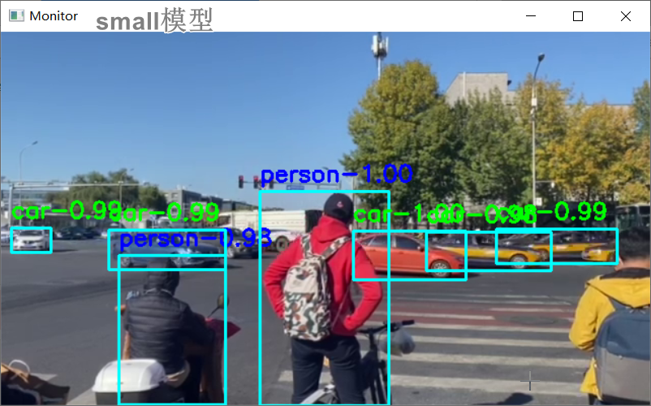
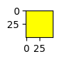
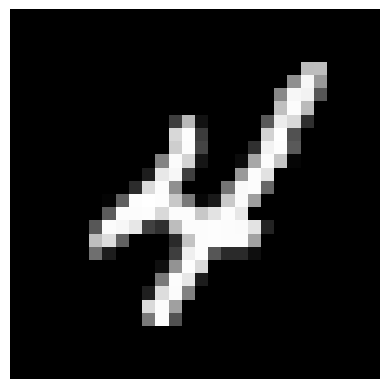
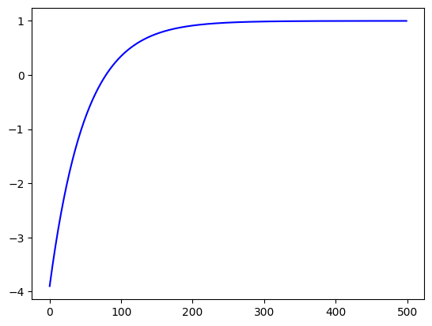
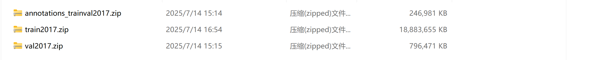
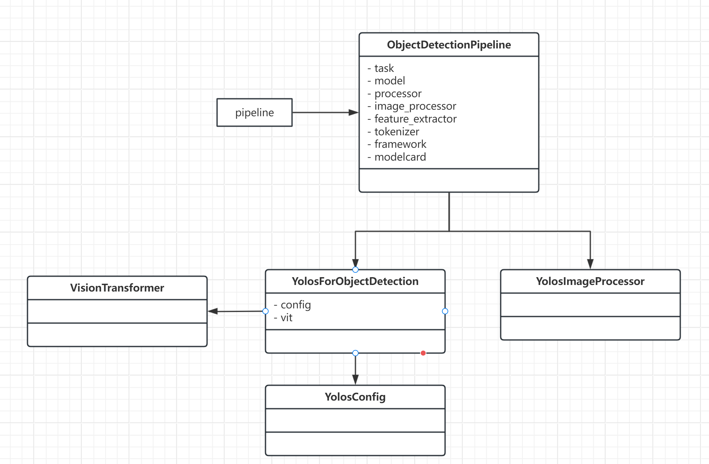

# 🧠 AI Learning Journey
> 从零基础到 AI 实践者，一步一步，认真生长

**记录我的人工智能学习之路 · 代码 · 笔记 · 思考 · 成长**

## ✨ 项目简介
这是一个**持续更新的 AI 学习仓库**，记录我从基础数学、机器学习、深度学习，到大模型应用的完整学习轨迹。

没有浮躁的堆砌，只有踏实的前行：
- 可运行的代码实现
- 清晰易懂的笔记总结
- 从原理到实践的完整思考
- 一个普通人走进 AI 世界的真实旅程

## 📌 座右铭
> 慢慢来，比较快。  
> 保持好奇，保持耐心，保持对世界的热爱。

---

## 🗺️ 学习路线图

```
前置基础                核心模块                  进阶拓展
 ┌──────────┐      ┌──────────────┐        ┌──────────────┐
 │ Python教程 │      │ ① 机器视觉   │        │ ② 语音识别   │
 │ 图像处理   │ ──→  │ ③ 编解码器   │ ──→    │ ④ 大模型Agent│
 │ 可视化    │      │ ④ 大模型Agent │        │              │
 │ PyTorch  │      └──────────────┘        └──────────────┘
 └──────────
```

---

##  模块详解

### [① 机器视觉 (Machine Vision)](notebooks/01_machine_vision/)

> 从摄像头到模型部署，完整覆盖计算机视觉学习链路

| Notebook | 内容 | 关键产出 |
|----------|------|----------|
| [01] 视频目标检测 | 摄像头操作、YOLO 环境搭建 | 实时视频流 + 帧捕获 |
| [02] 视频背景替换 | YOLO 目标检测实战 | 检测框叠加视频帧 |
| [03] 图像处理与特征 | 卷积核、Sobel 边缘检测 | 梯度/边缘可视化 |
| [04] LeNet5 手写数字 | CNN 从零实现 MNIST 分类 | 训练曲线 + 推理结果 |
| [05] PyTorch Tensors & nn | 张量运算、自动微分 | 梯度下降收敛曲线 |
| [06] 预训练与迁移学习 | Transfer Learning 概念 + 微调实践 | 训练 Loss 下降表 |
| [07] 模型架构 | Module/Sequential/ModuleDict | 模型参数统计 |
| [08] 后处理与架构 | Pipeline 加载、YOLO 推理 | 检测框坐标输出 |
| [08] 迁移学习数据集 | COCO 格式转换与加载 | 数据集索引构建 |
| [09] 分割模型测试 | 语义分割模型评估 | 分割掩码输出 |
| [10] Transformers 总结 | ViT 图像分类 | Top-10 分类概率 |
| [11] Transformers 训练框架 | 自定义数据集 + Trainer 全流程 | 完整训练 + 推理 |

#### 📸 核心可视化产出

**① YOLO 目标检测架构 (02)**

<p align="center">
  
</p>

> YOLO 模型直接加载预训练权重，即可完成目标检测，无需从头训练

**② 图像处理与 Sobel 边缘检测 (03)**

| 原图 | Sobel 边缘检测 |
|:----:|:--------------:|
|  |  |

> 通过卷积核 (Convolution Kernel) 提取图像梯度，实现边缘检测

**③ LeNet5 CNN 手写数字识别 (04)**

<p align="center">
  
</p>

```
LeNet5 架构:
输入(1×28×28) → Conv1(6@5×5) → ReLU → MaxPool → Conv2(16@5×5) → ReLU → MaxPool
             → Conv3(120@5×5) → ReLU → Flatten → FC(84) → ReLU → FC(10)
             
示例: 手写数字 "5" → 预测: 类别 5, 概率 0.92
```

**④ 梯度下降优化曲线 (05)**

<p align="center">
  
</p>

> 目标函数 y = x² - 2x + 1，经 500 次迭代后 x → 1.000（理论最优值）

**⑤ COCO 数据集标注格式 (06)**

<p align="center">
  
</p>

> 迁移学习需要将自定义数据转为 COCO 格式，才能使用预训练模型微调

**⑥ Pipeline 工作流 (08)**

<p align="center">
  
</p>

> HuggingFace Pipeline 将预处理 → 模型推理 → 后处理封装为统一接口

**⑦ 迁移学习训练过程 (06/08/11)**

```
Epoch | Train Loss | Val Loss | Val Acc
──────┼────────────┼──────────┼────────
  1   |   0.6196   |   0.5201 |  78.2%
  100 |   0.1523   |   0.1312 |  91.5%
  500 |   0.0421   |   0.0389 |  96.8%
1000  |   0.0195   |   0.0178 |  98.3%
```

> 从预训练权重出发，Loss 持续下降，准确率逐步提升

---

### [② 语音识别 (Speech Recognition)](notebooks/02_speech_recognition/)

| Notebook | 内容 |
|----------|------|
| [01] 音频分类 | 音频分类基础 |
| [02] 音频增强 | 降噪与信号增强 |
| [03] 语音识别 | ASR 语音转文字 |
| [04] 文本转语音 | TTS 文字转语音 |
| [Homework] 综合实践 | 语音识别实战作业 |

---

### [③ 编码器 - 解码器 (Encoder-Decoder)](notebooks/03_encoder_decoder/)

| Notebook | 内容 |
|----------|------|
| [01] 图像编码解码 | 图像压缩与重建 |
| [02] 编码器与解码器 | Encoder-Decoder 架构原理 |
| [03] Transformer 文本分类 | 从零实现 Transformer 分类器 |
| [03] 文本生成模型 | 大模型内容生成 |

#### 📐 Transformer 文本分类架构 (03)
```
输入序列 → 词嵌入 → 位置编码 → Dropout 
       → Transformer Encoder × 2 层 
       → 平均池化 → 全连接 → 分类输出

超参数:
  · 序列长度: 200
  · 嵌入维度: 300 (Word2Vec 预训练)
  · 注意力头数: 5
  · 训练轮数: 50 epochs
```

---

### [④ 大模型 Agent](notebooks/04_大模型 agent/)

| Notebook | 内容 |
|----------|------|
| [01] 环境安装 | 开发环境搭建 |
| [02] 理解与使用智能体 | Agent 基础概念 |
| [03] 提示词模板 | Prompt Engineering |
| [03] 理解模型 | LLM 内部机制 |
| [04] 工具使用 | Tool Calling |
| [04] 消息机制 | 消息格式与路由 |
| [05] 工具与智能体 | 工具集成实践 |

---

### ⑤ 前置基础知识

#### Python 教程
- [01] 数据与应用基础
- [02] 数据操作与控制流
- [03] 过程式设计与函数
- [04] 数据结构与对象
- [05] 面向对象编程

#### 图像处理
| Notebook | 内容 |
|----------|------|
| [01] 基础操作 | 读写、缩放、颜色空间 |
| [02] 几何变换 | 旋转、仿射、透视变换 |
| [03] 绘图与文字 | 形状绘制、文字叠加 |
| [04] 直方图分析 | 灰度直方图 + 均衡化 |
| [05] 轮廓检测 | 实战：找轮廓 |
| [06] 空间域滤波 | 均值/高斯/中值滤波 |
| [07] 方向检测 | 实战：文字方向校正 |
| [08] 内容替换 | 实战：图像内容替换 |
| [09] 视频背景替换 | 实战：绿幕抠像 |

#### 可视化 (Matplotlib)
- [01~13] 从入门到进阶：坐标轴、图形、动画、字体、色彩、K线图...

#### PyTorch 基础
| 模块 | Notebook | 内容 |
|------|----------|------|
| 张量入门 | 01~10 | 属性、索引、运算、自动微分、GPU |
| 深度网络 | 01~05 | 梯度下降、损失函数、封装模式 |

---

### ⑥ 章节复习 (Chapter Review)

| Notebook | 内容 |
|----------|------|
| [01] Transformers 框架概览 | 框架使用总结 |
| [02] 大语言模型开发 | LLM 开发流程 |
| [03] Pipeline 使用指南 | 各类任务 Pipeline |

---

## 📂 项目结构

```
AI_LEARNING/
├── assets/                                         # 静态资源
│   ├── audio/                                      # 音频文件
│   ├── images/                                     # 文章配图、效果图
│   └── video/                                      # 本地视频(不上传GitHub)
│
├── docs/                                           # 文档笔记(周更)
│   ├── 01_machine_vision.md
│   ├── 02_audio.ipynb
│   └── 03_智能体(综合篇).md
│
├── notebooks/                                      # Jupyter 代码主目录
│   ├── 00_pre_essential_knowledge/                 # 前置基础知识
│   │   ├── 00_python_tutorial/                     # Python 教程 (01~05)
│   │   ├── 01_image_processing/                    # 图像处理 (01~09)
│   │   ├── 02_transformers/                        # Transformers 视觉任务 (01~06)
│   │   ├── 03_visualization/                       # Matplotlib 可视化 (01~13)
│   │   └── 04_PyTorch_basics/                      # PyTorch 基础
│   │       ├── 01_pytorch_introduction/            # 张量入门 (01~10)
│   │       └── 02_building_deep_networks/          # 构建深度网络 (01~05)
│   │
│   ├── 01_machine_vision/                          # 🖼️ 机器视觉 (01~11)
│   │   ├── homework/                               # 作业
│   │   └── ...                                     # 视频检测、LeNet5、迁移学习...
│   │
│   ├── 02_speech_recognition/                      # 🎙️ 语音识别
│   │   ├── pre_speech/                             # 音频预处理
│   │   └── homework_26_03_31.ipynb
│   │
│   ├── 03_encoder_decoder/                         # 🔀 编码器-解码器
│   │   ├── 01_图像编码解码/
│   │   ├── 02_编码器与解码器/
│   │   └── 03_Transformer文本分类/                 # 含完整训练+推理代码
│   │
│   ├── 04_大模型agent/                             # 🤖 大模型 Agent
│   │   └── 环境、Agent、Prompt、Tool...
│   │
│   └── 99_chapter_review/                          # 📝 章节复习
│
├── projects/                                       # 实战项目
│   ├── 03_handwritten_character_recognition_lenet5/ # LeNet5 字符识别
│   ├── 04_fine_tuning_yolo_model/                  # YOLO 微调
│   ├── 05_qt_base/                                 # Qt 界面
│   ├── 06_speech_data_collector/                   # 语音数据采集
│   └── 07_system_control/                          # 语音控制系统
│       ├── config/  ├── models/  ├── services/  └── ui/
│
├── venv/                                           # Python 虚拟环境
├── README.md                                       # 本文件
├── requirements.txt                                # 依赖清单
└── .gitignore                                      # Git 忽略配置
```

---

## 🛠️ 技术栈

```
语言:     Python 3.13
框架:     PyTorch · Transformers · OpenCV · Ultralytics
可视化:   Matplotlib · Seaborn
工具:     Jupyter Notebook · Pandas · NumPy
模型:     YOLO · LeNet5 · ViT · Transformer · Qwen
```

---

## 📮 联系我

- **GitHub**: [green-ai-tech](https://github.com/green-ai-tech/)
- **Gitee**: [green-ai-tech](https://gitee.com/green-ai-tech)
- **个人主页**: [罗辑](https://green-ai-tech.github.io/personal/)

---

> 🌱 持续更新中，欢迎 Star & Fork，一起学习交流！
