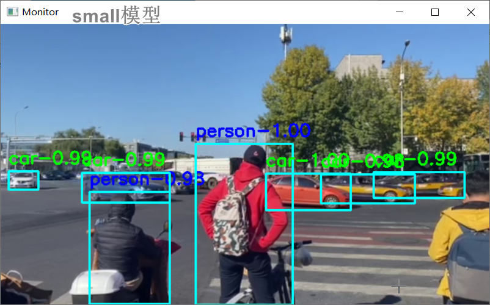
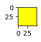
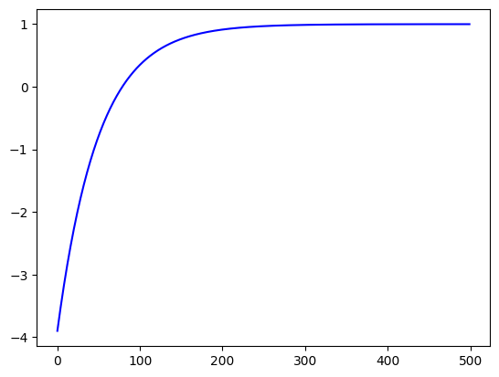
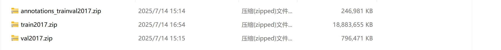
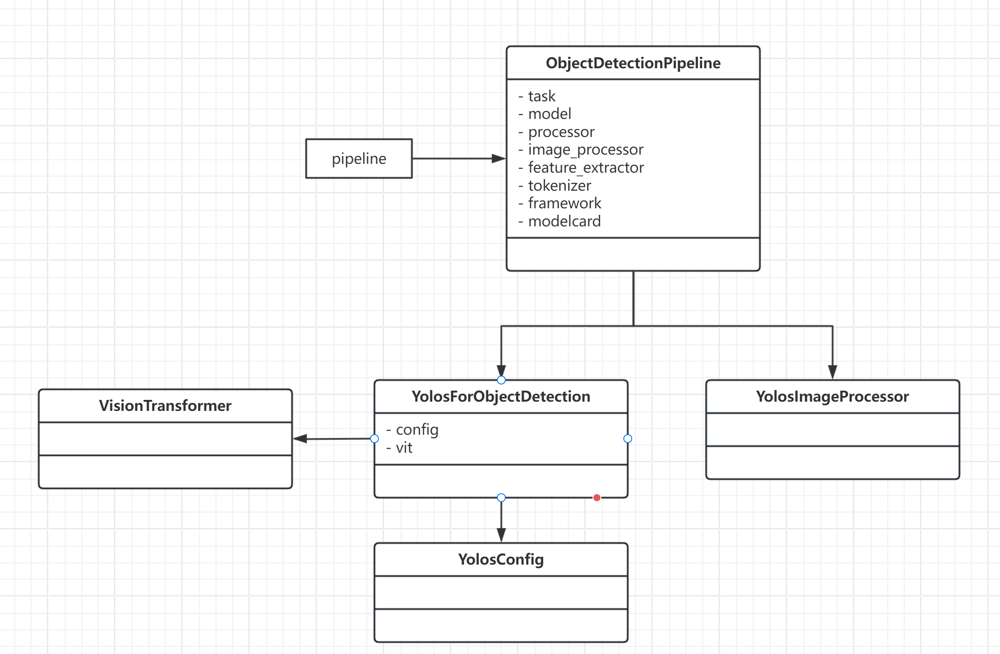

# 🧠 AI Learning Journey
> 从零基础到 AI 实践者，一步一步，认真生长

**记录我的人工智能学习之路 · 代码 · 笔记 · 思考 · 成长**

## ✨ 项目简介
这是一个**持续更新的 AI 学习仓库**，记录我从基础数学、机器学习、深度学习，到大模型应用的完整学习轨迹。

没有浮躁的堆砌，只有踏实的前行：
- 可运行的代码实现
- 清晰易懂的笔记总结
- 从原理到实践的完整思考
- 一个普通人走进 AI 世界的真实旅程

## 📌 座右铭
> 慢慢来，比较快。  
> 保持好奇，保持耐心，保持对世界的热爱。

---

## 🗺️ 学习路线图

```
前置基础                    核心模块                      进阶拓展
 ┌──────────┐          ┌──────────────┐           ┌──────────────┐
 │ Python教程 │          │ ① 机器视觉   │           │ ② 语音识别   │
 │ NumPy     │          │ ③ 编解码器   │           │ ④ 大模型Agent│
 │ 图像处理   │ ──────→  │ ④ 大模型Agent │ ───────→  │ ⑤ 实战项目   │
 │ 可视化    │          │              │           │              │
 │ PyTorch  │          └──────────────┘           └──────────────┘
 └──────────┘
```

---

##  模块详解

### [① 机器视觉 (Machine Vision)](notebooks/01_machine_vision/)

> 从摄像头到模型部署，完整覆盖计算机视觉学习链路

| Notebook | 内容 | 关键产出 |
|----------|------|----------|
| [01] 视频目标检测 | 摄像头操作、YOLO 环境搭建 | 实时视频流 + 帧捕获 |
| [02] 视频背景替换 | YOLO 目标检测实战 | 检测框叠加视频帧 |
| [03] 图像处理与特征 | 卷积核、Sobel 边缘检测 | 梯度/边缘可视化 |
| [04] LeNet5 手写数字 | CNN 从零实现 MNIST 分类 | 训练曲线 + 推理结果 |
| [05] PyTorch Tensors & nn | 张量运算、自动微分 | 梯度下降收敛曲线 |
| [06] 预训练与迁移学习 | Transfer Learning 概念 + 微调实践 | 训练 Loss 下降表 |
| [07] 模型架构 | Module/Sequential/ModuleDict | 模型参数统计 |
| [08] 后处理与架构 | Pipeline 加载、YOLO 推理 | 检测框坐标输出 |
| [08] 迁移学习数据集 | COCO 格式转换与加载 | 数据集索引构建 |
| [09] 分割模型测试 | 语义分割模型评估 | 分割掩码输出 |
| [10] Transformers 总结 | ViT 图像分类 | Top-10 分类概率 |
| [11] Transformers 训练框架 | 自定义数据集 + Trainer 全流程 | 完整训练 + 推理 |

#### 📸 核心可视化产出

**① YOLO 目标检测架构 (02)**

<p align="center">
  
</p>

> YOLO 模型直接加载预训练权重，即可完成目标检测，无需从头训练

**② 图像处理与 Sobel 边缘检测 (03)**

| 原图 | Sobel 边缘检测 |
|:----:|:--------------:|
|  |  |

> 通过卷积核 (Convolution Kernel) 提取图像梯度，实现边缘检测

**③ LeNet5 CNN 手写数字识别 (04)**

<p align="center">
  
</p>

```
LeNet5 架构:
输入(1×28×28) → Conv1(6@5×5) → ReLU → MaxPool → Conv2(16@5×5) → ReLU → MaxPool
             → Conv3(120@5×5) → ReLU → Flatten → FC(84) → ReLU → FC(10)
             
示例: 手写数字 "5" → 预测: 类别 5, 概率 0.92
```

**④ 梯度下降优化曲线 (05)**

<p align="center">
  
</p>

> 目标函数 y = x² - 2x + 1，经 500 次迭代后 x → 1.000（理论最优值）

**⑤ COCO 数据集标注格式 (06)**

<p align="center">
  
</p>

> 迁移学习需要将自定义数据转为 COCO 格式，才能使用预训练模型微调

**⑥ Pipeline 工作流 (08)**

<p align="center">
  
</p>

> HuggingFace Pipeline 将预处理 → 模型推理 → 后处理封装为统一接口

**⑦ 迁移学习训练过程 (06/08/11)**

```
Epoch | Train Loss | Val Loss | Val Acc
──────┼────────────┼──────────┼────────
  1   |   0.6196   |   0.5201 |  78.2%
  100 |   0.1523   |   0.1312 |  91.5%
  500 |   0.0421   |   0.0389 |  96.8%
1000  |   0.0195   |   0.0178 |  98.3%
```

> 从预训练权重出发，Loss 持续下降，准确率逐步提升

---

### [② 语音识别 (Speech Recognition)](notebooks/02_speech_recognition/)

| Notebook | 内容 |
|----------|------|
| [03] 语音识别基础 | 音频特征提取与模型训练 |
| [04] 语言识别 | 判断音频属于哪种语言 |
| [Homework] 综合实践 | 语音识别实战作业 |
| train_01.py | 基础模型训练脚本 |
| train_03.py | 进阶模型训练脚本 |

---

### [③ 编码器 - 解码器 (Encoder-Decoder)](notebooks/03_encoder_decoder/)

| Notebook | 内容 |
|----------|------|
| [01] 图像编码解码 | 图像压缩与重建（自编码器） |
| [02] 编码器与解码器 | Encoder-Decoder 架构原理（MNIST） |
| [03] Transformer 文本分类 | 从零实现 Transformer 分类器（Word2Vec + 多头注意力） |
| [03] 文本生成模型 | 大模型内容生成 |
| [04] 自注意力机制 | Query/Key/Value、多头注意力、位置编码详解 |

#### 📐 Transformer 文本分类架构 (03)
```
输入序列 → 词嵌入 → 位置编码 → Dropout 
       → Transformer Encoder × 2 层 
       → 平均池化 → 全连接 → 分类输出

超参数:
  · 序列长度: 200
  · 嵌入维度: 300 (Word2Vec 预训练)
  · 注意力头数: 5
  · 训练轮数: 50 epochs
```

---

### [④ 大模型 Agent](notebooks/04_LLM_agent/)

> 从环境搭建到多智能体协作，系统掌握 LLM 应用开发全链路

| Notebook | 内容 | 关键概念 |
|----------|------|----------|
| [01] 环境安装 | 开发环境搭建、API 接入 | Ollama、API Key |
| [02] 理解与使用智能体 | Agent 基础概念与首次实践 | 规划、记忆、工具 |
| [03] 提示词模板 | Prompt Engineering 模板化设计 | Zero-shot、Few-shot、CoT |
| [03] 理解模型 | LLM 工作原理与能力边界 | Token、上下文窗口 |
| [04] 工具使用 | Tool Calling 技术实践 | Function Calling |
| [04] 消息机制 | 多轮对话与上下文管理 | Message、Role |
| [05] 工具与智能体 | 构建完整 Tool-Agent 系统 | Agent Loop |
| [06] 结构化输出 | 强制模型输出 JSON/XML 格式 | Structured Output |
| [07] 检索增强 | RAG 检索增强生成 | Embedding、向量检索 |
| [08] Agent 循环 | Agent 迭代推理与自我修正 | ReAct、循环控制 |
| [09] 代理的记忆 | 长短期记忆管理 | Memory、Checkpointer |
| [10] LangGraph | 图结构 Agent 编排框架 | StateGraph、条件边 |
| [11] LangGraph 应用 | LangGraph 实战项目 | 工作流编排 |
| [12] 外部存储与流 | 持久化存储与流式输出 | Stream、Storage |
| [13] 多智能体 - 交接模式 | 多 Agent 协作（Handoff） | Agent 交接、分工 |
| [13] 多智能体 - 子智能体 | 多 Agent 子任务分解 | Sub-Agent、层级调度 |
| MCP | Model Context Protocol 实践 | MCP Server、MCP Agent |

---

### ⑤ 前置基础知识 ([notebooks/00_pre_essential_knowledge](notebooks/00_pre_essential_knowledge/))

#### Python 教程
- [01] 数据与应用基础
- [02] 数据操作与控制流
- [03] 过程式设计与函数
- [04] 数据结构与对象
- [05] 面向对象编程

#### 图像处理
| Notebook | 内容 |
|----------|------|
| [01] 基础操作 | 读写、缩放、颜色空间 |
| [02] 几何变换 | 旋转、仿射、透视变换 |
| [03] 绘图与文字 | 形状绘制、文字叠加 |
| [04] 直方图分析 | 灰度直方图 + 均衡化 |
| [05] 轮廓检测 | 实战：找轮廓 |
| [06] 空间域滤波 | 均值/高斯/中值滤波 |
| [07] 方向检测 | 实战：文字方向校正 |
| [08] 内容替换 | 实战：图像内容替换 |
| [09] 视频背景替换 | 实战：绿幕抠像 |

#### 可视化 (Matplotlib)
- [01~13] 从入门到进阶：坐标轴、图形、动画、字体、色彩、K线图...

#### PyTorch 基础
| 模块 | Notebook | 内容 |
|------|----------|------|
| 张量入门 | 01~10 | 属性、索引、运算、自动微分、GPU |
| 深度网络 | 01~05 | 梯度下降、损失函数、封装模式 |

---

### ⑥ 章节复习 (Chapter Review)

| Notebook | 内容 |
|----------|------|
| [01] Transformers 框架概览 | 框架使用总结 |
| [02] 大语言模型开发 | LLM 开发流程 |
| [03] Pipeline 使用指南 | 各类任务 Pipeline |

### ⑦ 打地基

| Notebook | 内容 |
|----------|------|
| NumPy 教程 | 数组操作、广播、线性代数基础 |

---

## 🏗️ 实战项目 (Projects)

> 将所学知识转化为可运行的产品，从脚本到工程化应用

### 传统 AI 项目

| 项目 | 技术栈 | 说明 |
|------|--------|------|
| [03 LeNet5 字符识别](projects/03_handwritten_character_recognition_lenet5/) | PyTorch · CNN | 手写字符识别系统 |
| [04 YOLO 微调](projects/04_fine_tuning_yolo_model/) | Ultralytics · COCO | 自定义数据集目标检测 |
| [05 Qt 界面](projects/05_qt_base/) | PySide6 | GUI 应用开发基础 |
| [06 语音数据采集](projects/06_speech_data_collector/) | PyAudio · PySide6 | 语音指令录制与管理 |
| [06 语音采集工具 v2](projects/06_new/) | PySide6 · PyAudio · pyqtgraph | 面向对象重构版，实时波形、标签管理、数据集导出 |
| [07 语音控制系统](projects/07_system_control/) | PySide6 · CNN · pyautogui | 按键录音 → 模型推理 → 系统控制（截屏/动鼠标/计算器） |

### 大模型应用项目

| 项目 | 技术栈 | 说明 |
|------|--------|------|
| [08 大模型聊天](projects/08_大模型聊天/) | Streamlit · LangChain · Ollama | 本地大模型对话应用 |
| [08 向量化桌面应用](projects/08_new_my/) | PySide6 · ChromaDB · Ollama | PDF/TXT 一键向量化 + PCA 可视化 |
| [09 RAG 入门](projects/09_RAG入门/) | LangChain · ChromaDB · Ollama | 检索增强生成 Demo |
| [10 智能体入门](projects/10_智能体入门/) | LangGraph · Tool Calling | 算术工具 Agent（加/乘/除） |
| [10 邮件回复智能体](projects/10_邮件回复/) | LangGraph · interrupt | 邮件分类 → 文档搜索 → 草稿生成 → 人工审核 |
| [12 股票智能体](projects/12_股票智能体/) | Streamlit · Agent | 股票分析智能应用 |
| [13 Transformer 翻译](projects/13_transformer_structured_text/) | PyTorch · Tokenizer · torchtext | Transformer 中英翻译模型 |

### 项目亮点

**① 语音控制系统 (07)**
```
用户按键 → 录音 → Mel频谱图 → SimpleCNN推理 → 执行动作
                                    ↓
                          动鼠标 / 截屏 / 打开计算器
```
> 完整的分层架构：config → models → services → ui，使用设计模式（依赖注入、观察者模式、工厂方法）

**② 向量化桌面应用 (08_new_my)**
```
PDF/TXT/MD → 文本清洗 → 分块 → Ollama Embedding → ChromaDB
                                            ↓
                                   PCA 降维可视化
```
> 支持多格式文件、后台线程处理、实时进度、暗色主题可视化

**③ 邮件回复智能体 (10)**
```
邮件 → 意图分类 → 文档搜索/Bug跟踪 → 草稿生成 → 人工审核 → 发送
         ↓              ↓
    billing?         bug?
    → 人工审核      → 工单创建
```
> LangGraph 图编排 + interrupt 人工中断机制

---

## 📂 项目结构

```
AI_LEARNING/
├── assets/                                         # 静态资源
│   ├── audio/                                      # 音频文件
│   ├── images/                                     # 文章配图、效果图
│   ├── pdf/                                        # PDF 素材
│   ├── vector_database/                            # ChromaDB 向量库
│   └── video/                                      # 本地视频(不上传GitHub)
│
├── docs/                                           # 文档笔记(周更)
│   ├── 01_machine_vision.md
│   ├── 02_audio.ipynb
│   └── 03_智能体的创建(入门版).ipynb
│
├── notebooks/                                      # Jupyter 代码主目录
│   ├── 00_pre_essential_knowledge/                 # 前置基础知识
│   │   ├── 00_python_tutorial/                     # Python 教程 (01~05)
│   │   ├── 01_image_processing/                    # 图像处理 (01~09)
│   │   ├── 02_transformers/                        # Transformers 视觉任务 (01~06)
│   │   ├── 03_visualization/                       # Matplotlib 可视化 (01~13)
│   │   └── 04_PyTorch_basics/                      # PyTorch 基础
│   │       ├── 01_pytorch_introduction/            # 张量入门 (01~10)
│   │       └── 02_building_deep_networks/          # 构建深度网络 (01~05)
│   │
│   ├── 01_machine_vision/                          # 🖼️ 机器视觉 (01~11)
│   │   ├── homework/                               # 作业
│   │   └── ...                                     # 视频检测、LeNet5、迁移学习...
│   │
│   ├── 02_speech_recognition/                      # 🎙️ 语音识别
│   │   ├── pre_speech/                             # 音频预处理
│   │   ├── train_01.py / train_03.py               # 训练脚本
│   │   └── homework_26_03_31.ipynb
│   │
│   ├── 03_encoder_decoder/                         # 🔀 编码器-解码器
│   │   ├── 01_图像编码解码/
│   │   ├── 02_编码器与解码器/
│   │   └── 03_Transformer文本分类/                 # 含完整训练+推理代码
│   │
│   ├── 04_LLM_agent/                               # 🤖 大模型 Agent
│   │   ├── 01~05  环境、Agent、Prompt、Tool、消息
│   │   ├── 06~09  结构化输出、RAG、Agent循环、记忆
│   │   ├── 10~12  LangGraph、应用、外部存储与流
│   │   ├── 13     多智能体（交接模式 / 子智能体）
│   │   ├── MCP/                                    # Model Context Protocol
│   │   └── vdb/                                    # 向量数据库
│   │
│   ├── 98_打地基/                                   # 🧱 基础补充
│   │   └── numpy教程.ipynb
│   │
│   └── 99_chapter_review/                          # 📝 章节复习
│       ├── 01_transformers_framework_overview.ipynb
│       ├── 02_large_language_model_development.ipynb
│       └── 03_pipeline_usage.ipynb
│
├── projects/                                       # 实战项目
│   ├── 03_handwritten_character_recognition_lenet5/ # LeNet5 字符识别
│   ├── 04_fine_tuning_yolo_model/                  # YOLO 微调
│   ├── 05_qt_base/                                 # Qt 界面
│   ├── 06_speech_data_collector/                   # 语音数据采集
│   ├── 06_new/                                     # 语音采集工具 v2 (OOP重构)
│   ├── 07_system_control/                          # 语音控制系统
│   │   ├── config/  ├── models/  ├── services/  └── ui/
│   ├── 08_大模型聊天/                              # Streamlit 聊天应用
│   ├── 08_new_my/                                  # 向量化桌面应用
│   ├── 09_RAG入门/                                 # RAG 检索增强 Demo
│   ├── 10_智能体入门/                              # LangGraph Agent
│   ├── 10_邮件回复/                                # 邮件回复智能体
│   ├── 12_股票智能体/                              # Streamlit 股票分析
│   └── 13_transformer_structured_text/             # Transformer 中英翻译
│
├── venv/                                           # Python 虚拟环境
├── README.md                                       # 本文件
├── requirements.txt                                # 依赖清单
└── .gitignore                                      # Git 忽略配置
```

---

## 🛠️ 技术栈

```
语言:       Python 3.13
深度学习:   PyTorch · Transformers · Ultralytics
计算机视觉: OpenCV · torchvision
语音处理:   torchaudio · PyAudio · librosa
NLP:        gensim (Word2Vec) · torchtext
大模型:     LangChain · LangGraph · Ollama (Qwen · Gemma)
向量数据库: ChromaDB
GUI:        PySide6 · PyQtGraph
Web:        Streamlit
可视化:     Matplotlib · Seaborn · scikit-learn (PCA)
数据处理:   Pandas · NumPy
工具:       Jupyter Notebook · tqdm
```

---

## 📮 联系我

- **GitHub**: [green-ai-tech](https://github.com/green-ai-tech/)
- **Gitee**: [green-ai-tech](https://gitee.com/green-ai-tech)
- **个人主页**: [罗辑](https://green-ai-tech.github.io/personal/)

---

> 🌱 持续更新中，欢迎 Star & Fork，一起学习交流！
