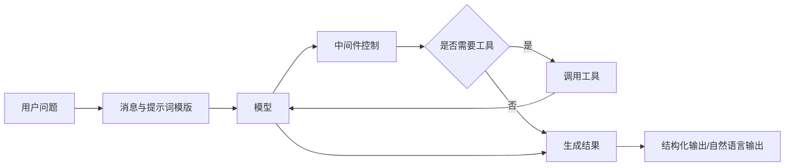
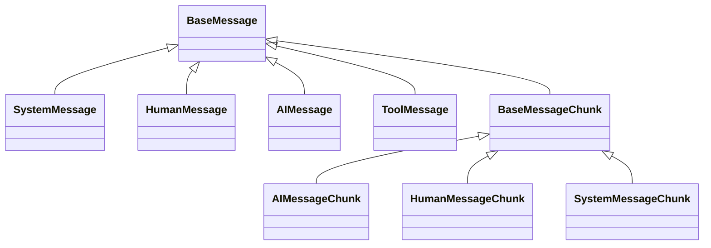
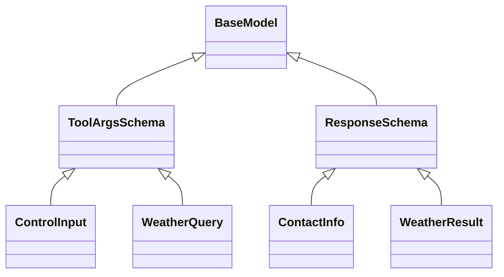
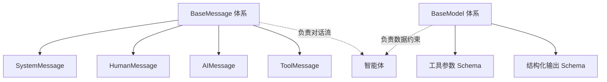

# 智能体的构建：从模型、消息、工具到可落地应用的完整流程

> 基于 `notebooks/04-大模型`、`projects/08_大模型聊天`、`projects/08_new_my` 与 `docs/03_智能体的创建(入门版).ipynb` 的综合整理

## 一、前言

在大模型开发中，很多同志一开始会把“模型调用”和“智能体构建”混为一谈。实际上，两者并不是同一个层次的问题。

模型调用解决的是“让模型回答问题”，而智能体构建解决的是“让模型在上下文、工具、流程控制和结果约束下，稳定地完成任务”。

从本仓库的学习路径来看，这条演进路线非常清晰：

- `notebooks/04-大模型/03_理解模型.ipynb` 讲模型初始化与调用
- `notebooks/04-大模型/03_提示词模版.ipynb` 讲提示词模版与链式调用
- `notebooks/04-大模型/04理解与使用消息.ipynb` 讲消息组织与历史上下文
- `notebooks/04-大模型/04_tool工具的使用.ipynb` 讲工具定义、绑定与执行
- `notebooks/04-大模型/05理解工具与智能体.ipynb` 讲中间件、结构化输出与智能体装配
- `projects/08_大模型聊天` 和 `projects/08_new_my` 则把这些能力真正落到了聊天应用中

因此，智能体的构建不是某一个 API 的记忆题，而是一套工程化的组装过程。

---

## 二、先给结论：智能体到底是什么

智能体不是“更大的模型”，而是“围绕模型构建的一套执行系统”。

它至少包含以下几个核心部件：

- 模型：决定推理与生成能力
- 消息：决定上下文如何被传递
- 提示词模版：决定输入如何被组织
- 工具：决定智能体是否能调用外部能力
- 中间件：决定调用过程如何被控制
- 结构化输出：决定结果是否能直接被程序消费

可以把它概括成下面这张图：



这也是整篇文章的主线。

---

## 三、构建流程总览

如果把智能体构建当作一个标准工程流程，可以拆成下面 6 步：

| 阶段 | 要解决的问题 | 对应技术 |
|---|---|---|
| 1. 模型初始化 | 用哪一个模型作为大脑 | `init_chat_model` |
| 2. 消息组织 | 如何表达 system、user、assistant | `BaseMessage` 体系 |
| 3. 提示词模版 | 如何稳定构造输入 | `PromptTemplate`、`ChatPromptTemplate` |
| 4. 工具接入 | 如何让模型访问外部能力 | `@tool`、`bind_tools` |
| 5. 流程控制 | 如何动态切换模型或拦截请求 | `middleware` |
| 6. 结果落地 | 如何让输出变成结构化数据 | `BaseModel`、`response_format` |

---

## 四、第一步：模型初始化

智能体的第一步，不是写工具，也不是写界面，而是先明确底层模型。

在本仓库里，模型初始化主要通过 `init_chat_model` 完成。例如 `notebooks/04-大模型/03_理解模型.ipynb` 和两个聊天项目里都使用了这套方式。

```python
from langchain.chat_models import init_chat_model

model = init_chat_model(
    model="ollama:qwen3.5:9b",
    temperature=0.7,
    num_predict=512,
    base_url="http://localhost:11434"
)
```

### 4.1 为什么模型初始化是第一步

因为模型初始化决定了 3 个核心问题：

- 智能体用谁来推理
- 智能体回答的稳定性如何
- 智能体后续是否适合工具调用、结构化输出和流式输出

### 4.2 课程代码中的演进

从项目实现可以看到一条很典型的演进路径：

- `projects/08_大模型聊天/聊天应用.py`：最基础的模型直接调用
- `projects/08_new_my/聊天王.py`：加入角色化提示词，形成“人格聊天”
- `projects/08_大模型聊天/pages/聊天模式.py`：加入工具，进入智能体阶段
- `projects/08_new_my/pages/聊天模式(开发ing).py`：加入工具、流式输出和多轮记录，逐步接近完整应用

### 4.3 模型层的常见参数

| 参数 | 作用 |
|---|---|
| `model` | 指定模型名称 |
| `temperature` | 控制输出随机性 |
| `num_predict` | 控制最大生成长度 |
| `base_url` | 指定本地推理服务地址 |
| `reasoning` | 某些模型支持显式推理模式 |
| `format` | 输出格式约束，如 `json` |

### 4.4 工程建议

- 普通问答优先轻量模型，追求速度和成本
- 复杂推理和工具调用优先更强模型，追求稳定性
- 不要一开始就把所有任务都交给同一个模型

---

## 五、第二步：消息系统是智能体的上下文骨架

如果说模型是大脑，那么消息系统就是神经网络中的“输入结构”。

在 LangChain 中，推荐尽量使用 `BaseMessage` 体系来表达对话，而不是全靠原始字符串拼接。课程内容在 `notebooks/04-大模型/04理解与使用消息.ipynb` 中对此做了系统整理。

### 5.1 BaseMessage 衍生关系图



### 5.2 各类消息的职责

| 类型 | 作用 |
|---|---|
| `SystemMessage` | 约束身份、目标、风格和规则 |
| `HumanMessage` | 用户输入 |
| `AIMessage` | 模型输出 |
| `ToolMessage` | 工具调用结果 |
| `BaseMessageChunk` | 流式输出的消息分片 |

### 5.3 为什么消息体系比字符串更重要

因为在真正的智能体流程里，输入不是一句话，而是“系统要求 + 历史上下文 + 当前问题 + 工具结果”的组合。

例如：

```python
from langchain.messages import SystemMessage, HumanMessage

messages = [
    SystemMessage(content="你是一个专业的客服助手。"),
    HumanMessage(content="帮我查询订单状态")
]
```

这比单纯写一行字符串更接近智能体的真实运行过程。

### 5.4 项目中的对应体现

- `projects/08_new_my/聊天王.py` 已经通过系统提示词构造“高斯人格”
- `projects/08_new_my/pages/聊天模式(开发ing).py` 已经用 `st.session_state.conversation_history` 保存了多轮对话
- 再往前一步，就是把这些历史记录统一转换为 `BaseMessage` 列表交给模型或 agent

---

## 六、第三步：提示词模版让输入从“可用”走向“可维护”

很多同志一开始会把 prompt 直接写成字符串。这样短期能跑，但长期不可维护。

课程在 `notebooks/04-大模型/03_提示词模版.ipynb` 中给出了非常清晰的答案：提示词模版的核心价值不在于“少写几个字”，而在于“把固定结构和动态参数分离开”。

### 6.1 PromptTemplate 与 ChatPromptTemplate

| 类型 | 适用场景 |
|---|---|
| `PromptTemplate` | 简单字符串模版 |
| `ChatPromptTemplate` | 结构化消息模版 |
| `MessagesPlaceholder` | 多轮对话历史插槽 |

### 6.2 基础示例

```python
from langchain_core.prompts import ChatPromptTemplate

template = ChatPromptTemplate.from_messages([
    ("system", "你是一个{role}，请给出简洁回答。"),
    ("human", "{query}")
])

messages = template.invoke({
    "role": "数据分析助手",
    "query": "请解释什么是智能体"
})
```

### 6.3 MessagesPlaceholder 的意义

这一步是从“单轮问答”升级到“多轮会话”的关键。

```python
from langchain_core.prompts import ChatPromptTemplate, MessagesPlaceholder

template = ChatPromptTemplate.from_messages([
    ("system", "你是一位友好的客服助手。"),
    MessagesPlaceholder(variable_name="chat_history"),
    ("human", "{input}")
])
```

### 6.4 为什么提示词模版是工程必需品

- 模板和数据分离，方便维护
- 可以部分填充，方便复用
- 可以组合消息历史，适合聊天场景
- 更容易和模型形成标准化调用链

### 6.5 与项目代码的关系

`projects/08_new_my/聊天王.py` 中目前仍然是：

```python
all_prompts = system_prompt + "\n\n" + user_prompt
```

这在入门阶段没有问题，但如果要继续升级成真正的智能体应用，建议逐步过渡到 `ChatPromptTemplate + MessagesPlaceholder` 的方式。因为随着角色、历史、工具结果增多，字符串拼接会很快失控。

---

## 七、第四步：工具让模型拥有“行动能力”

到这里，模型依然只是一个“会说话的大脑”。它能解释天气是什么，但它并不能真的查询天气。

工具就是智能体连接外部世界的桥梁。

课程在 `notebooks/04-大模型/04_tool工具的使用.ipynb` 和 `notebooks/04-大模型/05理解工具与智能体.ipynb` 中，分别从“工具定义”和“工具接入 agent”两个层面给出了示例。

### 7.1 工具的本质

工具的职责可以概括成三句话：

- 让模型访问实时信息
- 让模型触发外部动作
- 让智能体的“思考 -> 行动 -> 观察”闭环成立

### 7.2 最常见的工具写法

```python
from langchain.tools import tool

@tool
def get_weather(location: str) -> str:
    """
    获取指定位置的天气信息。
    """
    return f"{location} 当前天气晴朗，温度 25°C。"
```

### 7.3 工具为什么必须写 docstring 和类型注解

因为模型不是直接理解你的 Python 函数体，它主要依赖：

- 函数名
- 文档注释
- 参数类型
- 参数 schema

来判断这个工具能做什么、何时调用、参数该怎么填。

### 7.4 bind_tools 与 create_agent 的区别

这是一个非常容易混淆的点。

#### 方式一：绑定到模型

```python
model_with_tools = model.bind_tools([get_weather])
response = model_with_tools.invoke("北京天气怎么样？")
```

这时模型会产生 `tool_calls` 意图，但不一定完整跑完整个智能体流程。

#### 方式二：交给智能体

```python
from langchain.agents import create_agent

agent = create_agent(
    model=model,
    tools=[get_weather]
)
```

这时 agent 不只是“知道有工具”，而是会把工具执行循环也组织起来。

### 7.5 BaseModel 在工具中的作用

到这里，就要引出另一个关键类：`BaseModel`。

它不是消息系统的一部分，而是结构化数据的一部分。它通常用于：

- 定义工具输入参数模式 `args_schema`
- 定义智能体最终的结构化输出 `response_format`

### 7.6 BaseModel 衍生关系与使用位置图

严格来说，`BaseModel` 的衍生类不是 LangChain 消息类，而是 Pydantic 数据模型。它在智能体里主要承担“结构化约束”的职责。



### 7.7 用 BaseModel 约束工具参数

```python
from pydantic import BaseModel, Field
from langchain.tools import tool

class WeatherQuery(BaseModel):
    location: str = Field(description="要查询天气的城市名称")

@tool(args_schema=WeatherQuery)
def get_weather(location: str) -> str:
    """获取指定城市天气"""
    return f"{location} 当前天气晴朗"
```

这和课程中的 `ControlInput`、`InfoSchema`、`ContactInfo` 是同一个思路。

### 7.8 项目中的工具落地

在 `projects/08_大模型聊天/pages/聊天模式.py` 和 `projects/08_new_my/pages/聊天模式(开发ing).py` 中，已经实现了几个典型工具：

- `get_datetime`
- `get_weather`
- `get_news`
- `get_ip_info`

这说明项目已经不再是“纯聊天应用”，而是进入了“智能体应用”的范畴。

---

## 八、第五步：中间件让智能体具备流程编排能力

如果说工具解决的是“能做什么”，那么中间件解决的是“应该怎么做”。

课程在 `notebooks/04-大模型/05理解工具与智能体.ipynb` 中给出了一个很典型的例子：根据用户输入内容动态切换模型。

### 8.1 中间件的典型用途

- 动态切换模型
- 增加日志
- 限制调用
- 做权限校验
- 给特殊请求增加额外提示
- 为不同任务分配不同推理策略

### 8.2 动态切换模型示例

```python
from langchain.agents.middleware import wrap_model_call, ModelRequest, ModelResponse

@wrap_model_call
def switch_model(request: ModelRequest, handler) -> ModelResponse:
    if request.messages[0].content.startswith("#"):
        return handler(request.override(model=model_9b))
    return handler(request.override(model=model_4b))
```

### 8.3 这一步的工程意义

这说明智能体并不必须固定依赖一个模型，而是可以根据任务类型来做“模型路由”。

例如：

- 普通问答走轻量模型
- 代码生成走高能力模型
- 结构化抽取走稳定模型
- 工具密集型任务走更适合 tool calling 的模型

### 8.4 中间件与项目升级

当前两个聊天项目还没有真正引入中间件，但这正是它们下一步最值得升级的点。特别是 `projects/08_new_my/pages/聊天模式(开发ing).py` 已经出现多工具与流式输出，如果后续再加：

- 数学问题切到“高斯人格”
- 天气/新闻问题切到工具型 agent
- 复杂任务切到更强模型

就会形成真正有分工的智能体系统。

---

## 九、第六步：结构化输出让结果从“可读”变成“可用”

只有自然语言输出，意味着人能看懂，但程序不一定好处理。

而工程系统通常需要的是：

- JSON 风格的稳定字段
- 可以直接入库的结果
- 可以传给前端渲染的结构
- 可以作为下一步流程输入的数据对象

这就是结构化输出的意义。

### 9.1 结构化输出的核心写法

```python
from pydantic import BaseModel, Field

class ContactInfo(BaseModel):
    name: str = Field(description="姓名")
    email: str = Field(description="电子邮箱")
    phone: str = Field(description="电话号码")
```

然后把它交给 agent：

```python
agent = create_agent(
    model=model,
    tools=[],
    response_format=ContactInfo
)
```

### 9.2 这一步为什么重要

因为 agent 的结果将不再只是自由文本，而是一个符合 schema 的对象。课程中的联系人抽取例子已经验证了这一点。

### 9.3 BaseModel 和 BaseMessage 不要混淆

这是一个必须单独强调的点：

- `BaseMessage` 解决的是“对话输入输出的消息格式”
- `BaseModel` 解决的是“结构化参数和结果的字段格式”

两者都很重要，但职责完全不同。



---

## 十、create_agent：真正把前面几步装起来

前面 6 个部分其实都是在为 `create_agent` 服务。

课程在 `notebooks/04-大模型/02_理解与使用智能体.ipynb` 中已经给出了 `create_agent` 的主要参数。

一个典型的构建方式如下：

```python
from langchain.agents import create_agent
from langchain.messages import SystemMessage

agent = create_agent(
    model=model,
    tools=[get_weather, get_datetime],
    system_prompt=SystemMessage(content="你是一个天气与时间查询助手。"),
    middleware=[],
    response_format=None
)
```

### 10.1 create_agent 在做什么

它做的事情并不只是“保存一下对象”。

它实际上把下面这些能力装配成了一个统一入口：

- 使用哪个模型
- 使用哪些工具
- 系统提示词是什么
- 请求经过哪些中间件
- 结果是否需要结构化输出

所以，智能体的创建本质上就是“组件装配”。

---

## 十一、项目视角：从聊天应用到智能体应用的升级路径

结合本仓库中的 3 个项目文件，可以清晰看到一个很典型的升级过程。

### 11.1 第一阶段：模型直连

`projects/08_大模型聊天/聊天应用.py`

特点：

- 直接接收用户输入
- 直接调用 `model.invoke(prompt)`
- 直接显示结果

这个阶段的本质是“聊天模型应用”，还不是完整意义上的智能体。

### 11.2 第二阶段：角色增强

`projects/08_new_my/聊天王.py`

特点：

- 用系统提示词塑造高斯角色
- 引入多模型切换
- 在交互层构造更鲜明的应用风格

这个阶段本质上是在做“人格化聊天应用”。

### 11.3 第三阶段：引入工具

`projects/08_大模型聊天/pages/聊天模式.py`

特点：

- 接入日期、天气、新闻工具
- 使用 `create_agent`
- 对用户问题进行工具驱动回答

这一阶段开始真正进入智能体应用。

### 11.4 第四阶段：向完整智能体演进

`projects/08_new_my/pages/聊天模式(开发ing).py`

特点：

- 接入天气、时间、IP 工具
- 增加多轮会话记录
- 使用 `agent.stream(...)` 做流式输出

这一阶段已经非常接近完整的 agent 应用架构，只差：

- 消息体系更规范化
- 中间件引入
- 结构化输出引入
- 工具参数 schema 进一步规范

---

## 十二、综合运用：实现一个可落地的多功能助理智能体

下面给出一个综合示例，把前文的关键点串起来：

- 本地模型初始化
- 系统提示词
- 工具接入
- 中间件切换模型
- 结构化输出
- 适合接到 Streamlit 页面中

### 12.1 目标

我们实现一个“多功能助理智能体”，它具备以下能力：

- 查询时间
- 查询天气
- 对不同任务动态切换模型
- 最终输出结构化结果

### 12.2 综合示例代码

```python
import datetime
import requests
from pydantic import BaseModel, Field
from langchain.tools import tool
from langchain.chat_models import init_chat_model
from langchain.messages import SystemMessage
from langchain.agents import create_agent
from langchain.agents.middleware import wrap_model_call, ModelRequest, ModelResponse


# 1. 初始化两个模型
model_fast = init_chat_model(
    model="ollama:qwen3.5:4b",
    temperature=0.1
)

model_strong = init_chat_model(
    model="ollama:qwen3.5:9b",
    temperature=0.5
)


# 2. 定义工具
@tool
def get_datetime() -> str:
    """获取当前日期与时间"""
    return datetime.datetime.now().strftime("%Y-%m-%d %H:%M:%S")


@tool
def get_weather(location: str) -> str:
    """查询指定城市天气"""
    return f"{location} 当前天气晴朗，温度 25°C，湿度 40%"


# 3. 定义结构化输出
class AssistantResult(BaseModel):
    intent: str = Field(description="本次任务意图，如天气查询、时间查询、普通问答")
    answer: str = Field(description="给用户的最终回答")


# 4. 定义中间件
@wrap_model_call
def switch_model(request: ModelRequest, handler) -> ModelResponse:
    first_text = request.messages[0].content if request.messages else ""
    if "写代码" in first_text or "分析" in first_text:
        return handler(request.override(model=model_strong))
    return handler(request.override(model=model_fast))


# 5. 创建智能体
agent = create_agent(
    model=model_fast,
    tools=[get_datetime, get_weather],
    middleware=[switch_model],
    system_prompt=SystemMessage(
        content="你是一个中文多功能助理。需要时调用工具，最终用简洁清楚的中文回答。"
    ),
    response_format=AssistantResult
)


# 6. 调用智能体
result = agent.invoke({
    "messages": [
        {"role": "user", "content": "请告诉我北京天气，并顺便说一下现在时间"}
    ]
})

print(result["structured_response"])
```

### 12.3 这段代码覆盖了哪些知识点

| 模块 | 在代码中的体现 |
|---|---|
| 模型初始化 | `model_fast`、`model_strong` |
| 消息与提示词 | `SystemMessage` 与 `messages` 输入 |
| 工具 | `get_datetime`、`get_weather` |
| 中间件 | `switch_model` |
| 结构化输出 | `AssistantResult` |
| 智能体创建 | `create_agent(...)` |

### 12.4 如果接到 Streamlit 页面中

它与当前项目的整合方式也很直接：

```python
prompt = st.chat_input("请输入你的问题")

if prompt:
    result = agent.invoke({
        "messages": [{"role": "user", "content": prompt}]
    })

    st.write(result["structured_response"].answer)
```

如果需要流式输出，则可以进一步使用：

```python
for chunk, metadata in agent.stream(
    {"messages": [("user", prompt)]},
    stream_mode="messages"
):
    ...
```

这与 `projects/08_new_my/pages/聊天模式(开发ing).py` 中的写法已经非常接近。

---

## 十三、常见误区

### 13.1 把 prompt 拼接当成智能体

不是。prompt 拼接只能算模型调用的准备工作，离智能体还差工具、流程控制和结构化结果。

### 13.2 以为有了工具就一定会调用

不是。模型是否调用工具，依赖：

- 模型本身是否支持 tool calling
- 工具描述是否清楚
- 用户问题是否足够明确

### 13.3 混淆 BaseMessage 和 BaseModel

最常见也最值得纠正：

- `BaseMessage` 是消息
- `BaseModel` 是结构

前者服务于对话流，后者服务于结构化约束。

### 13.4 直接把 agent 对象放在 notebook 最后一行

很多 notebook 中最后写 `agent`，会直接显示一个图或对象结构。那不是报错，而是 Jupyter 在渲染 agent 对象本身。真正运行应该使用 `agent.invoke(...)` 或 `agent.stream(...)`。

---

## 十四、总结

智能体的构建，本质上不是“记住一个函数”，而是学会把多个组件按职责装起来。

从本仓库的学习与项目演进可以看出，一套完整的智能体构建思路应该是：

1. 用 `init_chat_model` 选定模型能力边界  
2. 用 `BaseMessage` 体系组织上下文  
3. 用 `PromptTemplate` / `ChatPromptTemplate` 规范输入  
4. 用 `@tool` 把外部能力接进来  
5. 用中间件做流程编排与策略控制  
6. 用 `BaseModel` 约束参数与结果  
7. 最后用 `create_agent` 统一装配

因此，真正的智能体不是“会聊天的大模型”，而是“可以在规则、工具和上下文中稳定完成任务的系统”。

---

## 十五、作业结语

如果用一句话概括本文：

> 智能体的构建，是把模型能力、消息机制、提示词模板、工具系统、中间件策略与结构化输出组织成一个统一执行框架的过程。

这也是从“调用大模型”走向“开发 AI 应用”的关键一步。
