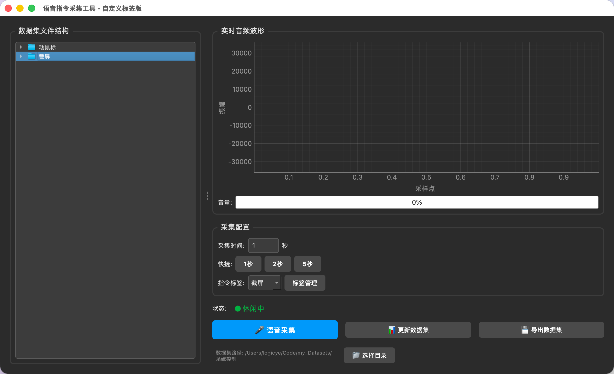

# 语音指令采集工具

一个基于 **PySide6** 和 **PyAudio** 开发的图形化语音指令采集工具，支持自定义标签、实时波形显示、数据集管理与导出功能。



---

## ✨ 核心功能

| 功能模块 | 说明 |
|---------|------|
| 🎤 **实时录音** | 支持 1~5 秒自定义时长语音采集 |
| 📊 **波形可视化** | 使用 Pyqtgraph 实时显示音频波形与音量 |
| 🏷️ **自定义标签** | 动态管理指令标签（新增/删除），自动创建文件夹 |
| 📁 **文件树浏览** | 左侧实时显示数据集目录结构，双击可播放音频 |
| 🔄 **数据集划分** | 一键生成训练集/验证集划分文件（`testing_list.txt`, `validation_list.txt`） |
| 💾 **导出功能** | 将完整数据集打包为 ZIP 文件，便于备份或迁移 |
| 📂 **路径切换** | 支持随时切换数据集根目录 |

---

## 📁 项目结构

```
06_new/
├── main.py                      # 程序入口（仅 20 行）
├── config.py                    # 全局配置（路径、参数、样式）
├── core/                        # 核心业务逻辑（无 UI 依赖）
│   ├── audio_recorder.py        # 音频录制线程（波形/音量信号）
│   ├── audio_player.py          # 音频播放线程
│   └── dataset_manager.py       # 数据集管理（标签、划分、导出）
├── ui/                          # 界面层
│   ├── main_window.py           # 主窗口（信号连接与布局）
│   └── dialogs/
│       └── label_manager.py     # 标签管理对话框
├── widgets/                     # 自定义组件
│   └── audio_file_model.py      # 文件树模型（过滤 wav/txt）
├── assets/                      # 资源文件
│   └── screenshot.png           # 界面截图
└── README.md                    # 本文件
```

---

## 🚀 快速开始

### 1. 环境要求
- Python 3.10+
- macOS / Windows / Linux

### 2. 安装依赖
```bash
# 进入项目目录
cd projects/06_new

# 安装依赖
pip install PySide6 pyaudio pyqtgraph numpy torchaudio
```

> **macOS 提示**: 如果 `pyaudio` 安装失败，请先安装 `portaudio`:
> ```bash
> brew install portaudio
> pip install pyaudio
> ```

### 3. 运行程序
```bash
python main.py
```

---

## 🎯 使用指南

### 采集语音指令
1. 在**采集配置**区域设置录音时长（或使用快捷按钮 1s/2s/5s）
2. 从**指令标签**下拉菜单选择对应的标签（如"截屏"、"动鼠标"）
3. 点击 **🎤 语音采集** 按钮开始录音
4. 录音完成后，文件自动保存到对应标签文件夹

### 管理标签
1. 点击 **标签管理** 按钮打开管理对话框
2. 点击 **新增标签** 输入新名称，系统会自动创建对应文件夹
3. 选中标签后点击 **删除选中** 可删除标签及其文件夹（⚠️ 会丢失内部音频）

### 播放音频
- 在左侧**数据集文件结构**中，双击任意 `.wav` 文件即可播放

### 更新数据集
1. 完成一批语音采集后，点击 **📊 更新数据集**
2. 系统自动按 80/20 比例划分训练集和验证集
3. 生成 `testing_list.txt` 和 `validation_list.txt` 文件

### 导出数据集
1. 点击 **💾 导出数据集**
2. 选择保存位置和文件名
3. 系统将所有 `.wav` 和 `.txt` 文件打包为 ZIP

### 切换数据集目录
- 点击右下角 **📁 选择目录** 按钮，选择新的数据集根目录

---

## 🔧 技术架构

### 核心模块 (`core/`)
| 模块 | 职责 |
|------|------|
| `AudioRecorderThread` | 基于 PyAudio 的多线程录音，实时发射波形和音量信号 |
| `AudioPlayer` | 基于 wave + PyAudio 的音频播放线程 |
| `DatasetManager` | 纯逻辑类，负责标签扫描、数据集划分、ZIP 导出（无 UI 依赖） |

### UI 模块 (`ui/`)
| 模块 | 职责 |
|------|------|
| `VoiceCommandCollector` | 主窗口，负责界面布局与信号连接 |
| `LabelManageDialog` | 标签增删对话框 |

### 组件模块 (`widgets/`)
| 模块 | 职责 |
|------|------|
| `AudioFileSystemModel` | 自定义 `QFileSystemModel`，仅显示 `.wav` 和 `.txt` 文件 |

### 配置模块 (`config.py`)
所有魔法数字集中管理：
```python
# 音频参数
SAMPLE_RATE = 16000
CHANNELS = 1
CHUNK_SIZE = 1024

# 默认路径
DEFAULT_DATASET_DIR = "/Users/logicye/Code/my_Datasets/系统控制"

# 默认标签
DEFAULT_LABELS = ["动鼠标", "截屏"]

# 数据集划分比例
TRAIN_RATIO = 0.8
```

---

## 📝 开发笔记

### 面向对象重构
本项目已从原始的 **643 行单文件** 重构为 **模块化架构**：
- ✅ 核心逻辑与 UI 完全解耦
- ✅ 每个类独立成文件，职责单一
- ✅ 全面使用类型提示 (`typing`)
- ✅ 配置集中管理，易于扩展

### 线程安全
- 音频录制和播放均在 **QThread** 子线程中执行
- 通过 **Qt Signal/Slot** 机制安全更新 UI
- 录制过程中禁用采集按钮，防止重复启动

---

## 🐛 常见问题

**Q: 录音时没有声音/报错？**
- 检查系统是否授予了麦克风权限（macOS: 系统设置 > 隐私与安全性 > 麦克风）
- 确认 `pyaudio` 已正确安装

**Q: 如何添加新的指令标签？**
- 点击"标签管理"按钮，在对话框中点击"新增标签"即可

**Q: 数据集划分比例可以修改吗？**
- 可以，在 `config.py` 中修改 `TRAIN_RATIO` 的值

---

## 📅 更新记录

| 日期 | 版本 | 更新内容 |
|------|------|----------|
| 2026-04-11 | v2.0 | **面向对象重构**，模块化架构，核心逻辑与 UI 分离 |
| 2026-03-31 | v1.0 | 初始版本，单文件实现全部功能 |

---

## 📄 许可证

本项目仅供学习与研究使用。
